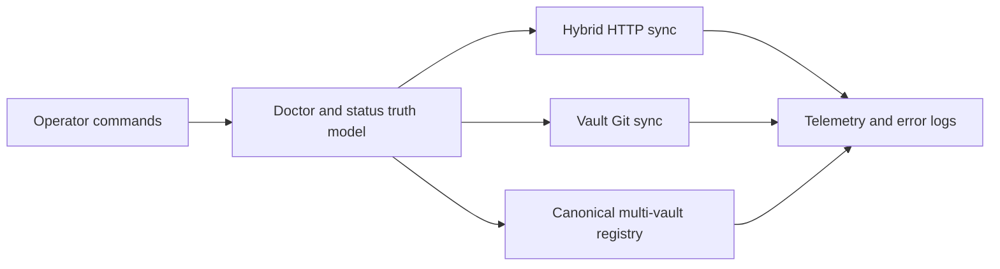

# Vault Stability and Spec-Write Remediation Plan

## Evidence acquired
- `$HOME/.spec-memo/config.json` is in `hybrid` mode with `vaultGit.enabled: true`, telemetry enabled, and AI disabled. Its persisted `version` is `0.1.0`, while `package.json` is `0.37.2`.
- `memo doctor --json` exited `1`: FTS is healthy at 3,191 indexed records, the remote daemon is reachable with HTTP 200, and no conflict sidecars or semantic contradictions were found. The failures are 70 in-repo plan-residue files plus outdated Opencode/Cursor hooks stamped `0.37.1`.
- `memo status --json` exited `0`: 12 vault projects, 22.5 MiB SQLite index, two backups totaling about 5.14 MiB, and all local daemons stopped. The remote is reachable.
- Telemetry covers 23,214 valid JSONL events from 2026-09-09 through 2026-09-22, about 5.42 MB across 14 daily files. It contains 1,617 failures, 132 sync events, 37 failed sync events, and 607 events over five seconds. The worst calls were a 126.5-second bootstrap and a 106.5-second dual sync.
- `sync_dual` failed 32/65 times. The current error log records the concrete vault-git failure `Author identity unknown`; the current vault Git identity is now configured, but the root Git tree still has 17 changed/untracked paths while `.sync/vault-git-state.json` reports `dirty: false`.
- `memo vault list --json` shows duplicate/aliased projects: WorkflowOS has a two-record alias beside its canonical project, Marchante has a two-record alias plus a separate `MarchanteERP` fallback project, and several local fallback projects are transient tool/runtime roots.
- Tracking drift is real: `0057-status-ai-ops-logs` is still `[ ] todo` in [`.agents/specs/index.PRD`](.agents/specs/index.PRD) despite the shipped AI Ops implementation; shipped specs `0029`, `0051`, `0052`, `0060`, `0063`, and `0064` still carry `draft`/`issueState: open` metadata. `FEATURES.md`, `PLAN.md`, `package-lock.json`, CLI help, and README contain stale version or parallel-sync claims.
- The completed sweep found a concrete status defect: `memo status` reports `telemetry/usage.jsonl`, while the writer actually creates `telemetry-YYYY-MM-DD.part-N.jsonl`. Telemetry readers exist but are not exposed through CLI, doctor, or status APIs.
- Historical error-log backups show earlier vault-Git remote/bootstrap failures and port/auth contention; the current window is quieter and is dominated by agent-side MCP contract warnings. The latent Git identity risk remains because the vault repository has no local author configuration even though effective global identity currently allows commits.
- The only genuinely unimplemented tracked feature is [`.agents/specs/0027-virtual-file-system-over-mcp.spec.md`](.agents/specs/0027-virtual-file-system-over-mcp.spec.md). It remains a draft/todo and must not be accidentally marked shipped while synchronizing the other specs.

## Target architecture

## Implementation phases

1. **Containment and baseline, no destructive cleanup**
   - Snapshot current doctor/status output, vault Git status, alias list, backup inventory, and telemetry/error-log summaries.
   - Do not run `memo doctor --fix` or purge/merge vaults yet. The 70 ignored `.agents/plans` files must be classified as active, completed, or stale first; root [AGENTS.md](AGENTS.md) explicitly forbids wiping the plans directory.
   - Add a read-only operator preflight that reports whether vault Git has a configured author, whether the live allow-listed tree is dirty, and whether the persisted sync state is stale.

2. **Make doctor and status truthful**
   - Update [src/doctor.ts](src/doctor.ts), [src/status-cmd.ts](src/status-cmd.ts), [src/vault.ts](src/vault.ts), and [src/vault-git-state.ts](src/vault-git-state.ts) to distinguish persisted channel state from live filesystem/Git state.
   - Report live vault-Git porcelain, last successful channel flush, last failure phase, configured author availability, hook version drift, ignored residue count, and FTS source/index consistency.
   - Add a consistency check that compares canonical Markdown record IDs against SQLite rows and excludes compiled views, project metadata, and conflict sidecars from the record universe.
   - Keep read-only commands non-mutating, including malformed-config and empty-vault cases.

3. **Harden hybrid and vault-Git synchronization**
   - Focus on [src/dual-sync.ts](src/dual-sync.ts), [src/hybrid-sync.ts](src/hybrid-sync.ts), [src/vault.ts](src/vault.ts), [src/sync.ts](src/sync.ts), [src/server.ts](src/server.ts), and [src/prompt.ts](src/prompt.ts).
   - Preserve the proven Windows-safe ordering, hybrid HTTP first then vault-Git, and update all stale user-facing text that still says the channels run in parallel.
   - Make every dual-sync result carry independent hybrid and vault-Git status, error code, phase, duration, dirty-state transition, and cursor impact. Replace opaque `DUAL_SYNC_FAILED`-only telemetry with channel detail while retaining the aggregate result.
   - Bound both network and local apply/rebuild work. Instrument pull, apply, compiled-view rebuild, commit, rebase, and push separately so a 100-second call is diagnosable; keep single-flight and vault locking out of network waits.
   - Treat missing Git identity, rebase conflicts, Windows file locks, timeout, remote 4xx/5xx, and partial per-record skips as explicit fail-open states with durable `lastError` and no false clean transition.
   - Add a dry-run/real-run parity check for `memo sync --all`, including cursor advancement only for acknowledged records and preservation of dirty state for skipped/conflicted records.

4. **Repair multi-vault identity and alias hygiene**
   - Use [src/identity.ts](src/identity.ts), [src/vault-manager.ts](src/vault-manager.ts), [src/canvas.ts](src/canvas.ts), and the existing vault CLI/status paths as the single canonicalization path.
   - Add an audit report for aliases, duplicate remote identities, fallback roots under tool/runtime directories, orphaned projects, record counts, and last-seen roots.
   - Reconcile the known WorkflowOS and Marchante aliases only after backup and a record-count/content comparison. Keep the separate `MarchanteERP` fallback project quarantined until its records are proven duplicate or intentionally distinct.
   - Make all search, bootstrap, sync, status, backup, and wiki operations resolve aliases consistently and test that alias targets cannot create split cursors or split dirty flags.

5. **Bound and improve observability**
   - Update [src/error-logger.ts](src/error-logger.ts), [src/telemetry.ts](src/telemetry.ts), [src/status.ts](src/status.ts), and the status dashboard contracts.
   - Keep telemetry append-only and redacted, but add a machine-readable summary for failure rates, p50/p95/p99 duration, per-project sync health, and top error codes. Current raw data shows that expected CLI `EXIT_1`, install permission prompts, and HTTP 401s dominate the failure count and should be separated from product faults.
   - Fix the status telemetry path to resolve the actual rolling part files, then expose bounded telemetry summaries through a read-only CLI/status/doctor surface. Do not load the full history into the dashboard.
   - Add bounded error-log rotation/retention for `error.logs` and its backups; preserve the existing 2 MiB newest-tail viewer contract and never delete operator logs implicitly.
   - Add explicit counters for status probe noise, test-originated writes, sync conflicts, skipped records, view-rebuild skips, and vault-Git dirty transitions. Keep secrets, bearer material, absolute paths, and prompt bodies redacted.
   - Keep reconcile visibility CLI-first for the first pass; a dedicated status tab is optional after the channel and sidecar data are trustworthy.
   - Keep AI disabled by default. Treat the empty AI Ops journal as expected under the current config, not as an AI outage.

6. **Repair spec-write and release tracking consistency**
   - Reconcile [`.agents/specs/index.PRD`](.agents/specs/index.PRD), [PLAN.md](PLAN.md), [FEATURES.md](FEATURES.md), [PRODUCT.PRD](PRODUCT.PRD), [README.md](README.md), and the affected spec frontmatter.
   - Mark `status-ai-ops-logs` complete with the shipped implementation and add its proof to the done log. Mark shipped issue specs `us-54`, `us-55`, `open-github-issues-batch`, `ai-ops-test-ai-button`, and `ai-timeout-config` closed/completed; change `prompt-history-and-query` from `draft` to its shipped status. Leave `virtual-file-system-over-mcp` as draft/todo because it is genuinely unscheduled.
   - Align `package.json`, `package-lock.json`, generated skill versions, README/FEATURES/PLAN version lines, and docs-site artifacts to `0.37.2` or the next approved release version. Correct the CLI help and README lines that still claim dual sync is parallel.
   - Add a spec-index lifecycle check so a shipped Done-log entry cannot coexist with `[ ] todo`, `issueState: open`, or `status: draft` without an explicit exception.
   - Run the canonical workflow-skills authoring validator when available; this checkout does not contain a local `ws-spec-write` or `validate_spec.cjs`, so that validation must be an explicit implementation prerequisite rather than assumed.
   - Keep `virtual-file-system-over-mcp` explicitly deferred. If it is later promoted, split the work into an authoring/format pass and a separately approved implementation slice for `originRelPath`, MCP resources, cleanup, restore, and capability gating.

## Verification gates

- `npm run build`, `npm test`, `npm run check:site`.
- Targeted suites: `dist/doctor.test.js`, `dist/status-cmd.test.js`, `dist/vault-git-hybrid-sync.test.js`, `dist/reconcile.test.js`, `dist/telemetry.test.js`, `dist/error-logger.test.js`, `dist/vault.test.js`, `dist/status.test.js`, and `dist/multi-clone.test.js`.
- Windows fixtures for missing Git identity, dirty-tree rebase, lock contention, timeout, alias merge, stale cursor, partial changeset skip, and read-only doctor/status.
- Operator smoke checks after implementation: `memo doctor --json`, `memo status --json`, `memo vault list --json`, verify `operational.telemetry.logFile` points to an existing rolling file, `memo sync --dry-run --json`, then a controlled real `memo sync --all --json` after a fresh backup.
- Exit criteria: doctor reports only intentional, explicitly classified residue; live vault-Git dirty state matches `.sync/vault-git-state.json`; dual sync exposes per-channel truth; no unbounded error-log growth; all shipped specs and version artifacts agree.

## Safe next action

Approve this plan, then implement Phase 1 first. Before any cleanup or alias merge, create a fresh vault backup and review the generated classification manifest.