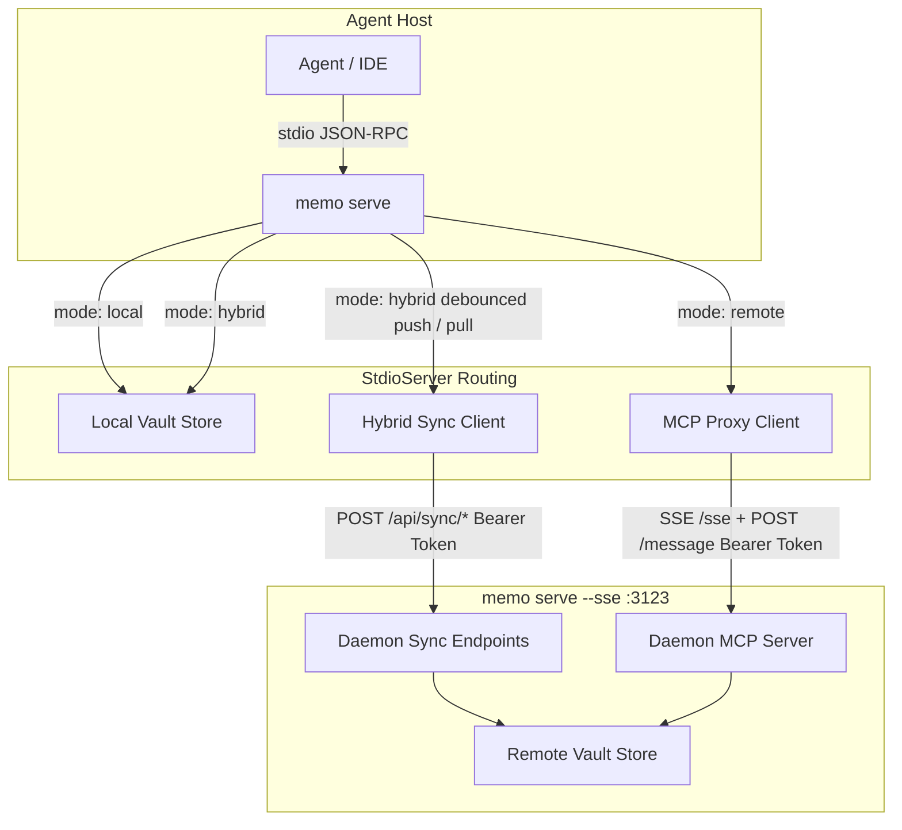

# Implementation Plan — Local, Hybrid, and Remote Deployment Modes (`deployment-modes.spec.md`)

This plan covers the implementation of **Local, Hybrid, and Remote deployment modes** with portable MCP wiring as specified in [`.agents/specs/deployment-modes.spec.md`](file:///l:/source/spec-memo/.agents/specs/deployment-modes.spec.md).

spec-memo will support three deployment modes without requiring agent host MCP configuration rewrites:
1. **Local**: Default MCP stdio reading/writing local vault at `~/.spec-memo` (or `$SPEC_MEMO_ROOT`). No network required.
2. **Hybrid**: Local stdio MCP and local vault, plus authenticated HTTP changeset sync with a remote SSE daemon (`memo serve --sse`). Automatic pull on `bootstrap` for cwd-bound `projectId`, debounced push on mutating tool calls, explicit `memo sync`, fail-open when remote is unreachable.
3. **Remote**: stdio `memo serve` proxies the 10 MCP tools and CLI commands to the remote daemon's SSE transport (`/sse`). Config and diagnostics live locally; vault data lives on the daemon host; fail-closed when remote is unreachable.

---

## User Review Required

> [!IMPORTANT]
> - **Zero-reconfiguration host contract**: All agent hosts (Cursor, VS Code, OpenCode, Antigravity, Claude Desktop) continue running local stdio `memo serve`. Mode switching is governed purely by `~/.spec-memo/config.json`.
> - **Environment Token Rule**: Auth tokens (`SPEC_MEMO_AUTH_TOKEN` / `SPEC_MEMO_SSE_TOKEN`) are never written to `config.json`, `hybrid-state.json`, vault-git commits, or backups.
> - **10-Tool Contract**: No new MCP tool is added. Hybrid sync routes are authenticated HTTP on the SSE daemon (`/api/sync/*`).

---

## Proposed Changes

---

### Phase 1: Config Schema, `memo setup`, Extended `memo doctor`, and `ws-memo` Configure

#### [MODIFY] [src/types.ts](file:///l:/source/spec-memo/src/types.ts)
- Extend `VaultConfig` with `mode?: 'local' | 'hybrid' | 'remote'` (default `'local'`) and `remote?: { url: string }`.
- Add `SetupOptions`, `SetupResult`, `HostName` types.
- Extend `DoctorResult` with `mode`, `remoteUrl`, `tokenConfigured`, `hybridState`, `remoteHealth`.

#### [NEW] [src/setup.ts](file:///l:/source/spec-memo/src/setup.ts)
- Implement `normalizeRemoteUrl(rawUrl: string): string` (strips `/sse`, `/message`, trailing slashes; validates `http://` or `https://`).
- Implement `generateHostMcpSnippet(host: HostName, command?: string)` for `cursor`, `vscode`, `opencode`, `antigravity`, `claude`, `generic`.
- Implement `runSetup(options: SetupOptions)`:
  - Merges into `~/.spec-memo/config.json` preserving `ttl`, `vaultGit`, `embeddings`, `bootstrap`.
  - Rejects missing URL or missing env token (`SPEC_MEMO_AUTH_TOKEN` / `SPEC_MEMO_SSE_TOKEN`) in non-interactive hybrid/remote mode.
  - Implements `--print-mcp --host <name>` and opt-in `--write-mcp --host <name>`.

#### [MODIFY] [src/doctor.ts](file:///l:/source/spec-memo/src/doctor.ts)
- Add mode reporting, remote URL validation, token presence check.
- In `hybrid` mode: inspect hybrid state and check `GET {origin}/health` with bearer auth (warning on failure; fail-open).
- In `remote` mode: check `GET {origin}/health` with bearer auth (failure on unreachable; fail-closed).
- Missing/omitted `mode` is treated as `'local'` without flagging corruption.

#### [MODIFY] [src/cli.ts](file:///l:/source/spec-memo/src/cli.ts)
- Register `memo setup` command with flags `--mode`, `--url`, `--print-mcp`, `--write-mcp`, `--host`, `--json`.
- Update `doctor` reporting with mode and remote health information.

---

### Phase 2: Daemon HTTP Changeset Sync & Hybrid Dual-Sync Engine

#### [NEW] [src/hybrid-state.ts](file:///l:/source/spec-memo/src/hybrid-state.ts)
- Manage `~/.spec-memo/.sync/hybrid-state.json` (machine-local state: `dirty`, `lastSyncAt`, `lastError`, `cursors`).
- Excluded from vault-git commits and backup archives.

#### [MODIFY] [src/server.ts](file:///l:/source/spec-memo/src/server.ts)
- Add authenticated HTTP sync routes to `memo serve --sse`:
  - `POST /api/sync/pull`: exports changeset for specified `projectId` / `since`.
  - `POST /api/sync/push`: applies incoming changeset via `applyChangeset`.
  - `POST /api/sync`: two-way sync round-trip.
- Protected by `isAuthorized` with bearer token validation.

#### [NEW] [src/hybrid-sync.ts](file:///l:/source/spec-memo/src/hybrid-sync.ts)
- Implement `pullHybridProject(vaultRoot, projectId, remoteUrl, token)`
- Implement `pushHybridProject(vaultRoot, projectId, remoteUrl, token)`
- Implement `syncHybrid(vaultRoot, options: { all?: boolean, dryRun?: boolean, ... })`
- Implement debounced push queue (`scheduleHybridPush`) coalescing rapid bursts (2000ms debounce).
- Implement fail-open error handling (marks `dirty` and `lastError` without rolling back local mutations).

#### [MODIFY] [src/bootstrap.ts](file:///l:/source/spec-memo/src/bootstrap.ts)
- In `hybrid` mode: best-effort pull for the bound `projectId` prior to brief compilation.
- If pull fails: record warning in `brief.notices` and mark hybrid state dirty/error; fail open returning local data.

#### [MODIFY] [src/tools.ts](file:///l:/source/spec-memo/src/tools.ts)
- On mutating operations (`upsert`, `append`, `forget`, `gc`), if mode is `hybrid`, schedule debounced push for the affected `projectId`.

#### [MODIFY] [src/cli.ts](file:///l:/source/spec-memo/src/cli.ts)
- Route `memo sync [--all] [--dry-run] [--json]` to `syncHybrid` when mode is `hybrid`.

---

### Phase 3: Remote stdio MCP Proxy & Remote CLI Extras

#### [NEW] [src/mcp-proxy.ts](file:///l:/source/spec-memo/src/mcp-proxy.ts)
- Create stdio MCP server proxy that forwards the 10 MCP tools to the remote daemon's SSE endpoint (`/sse` + `/message`).
- Passes through tool results and errors faithfully.
- Fails closed with structured errors when the daemon is unreachable.

#### [MODIFY] [src/mcp.ts](file:///l:/source/spec-memo/src/mcp.ts) & [src/cli.ts](file:///l:/source/spec-memo/src/cli.ts)
- If `mode === 'remote'`, `memo serve` starts the remote MCP proxy.
- 10 CLI commands proxy to remote daemon.
- `memo rank` proxies to remote search/rank.
- `memo doctor`, `memo setup`, `memo check-version` run locally.
- CLI extras `memo canvas`, `memo sync-vault`, `memo export-vault`, `memo import-vault`, `memo hook install` exit non-zero with `not available in remote mode`.

---

### Documentation & Skills Update

#### [MODIFY] [.agents/skills/ws-memo/SKILL.md](file:///l:/source/spec-memo/.agents/skills/ws-memo/SKILL.md) & [references/SURFACE.md](file:///l:/source/spec-memo/.agents/skills/ws-memo/references/SURFACE.md)
- Add **configure** intent / step: check config, run setup interview (mode, URL, token env reminder).
- Update session step: run doctor before bootstrap.
- Document local, hybrid, and remote modes and token policy.

#### [MODIFY] [README.md](file:///l:/source/spec-memo/README.md) & [AGENTS.md](file:///l:/source/spec-memo/AGENTS.md)
- Document the 3 deployment modes, `memo setup`, hybrid sync, stdio proxy, and environment token requirements.

---

## Verification Plan

### Automated Tests
Create comprehensive test suites in `src/deployment-modes.test.ts` and `src/hybrid-sync.test.ts`:
1. **Config & Setup Tests**:
   - `VaultConfig` defaults `mode` to `'local'` when omitted.
   - URL normalization strips `/sse`, `/message`, trailing slashes, and validates `http://`/`https://`.
   - Setup preserves existing `ttl`, `vaultGit`, `embeddings`, `bootstrap`.
   - Setup refuses missing URL or missing env token in hybrid/remote mode.
   - Setup `--print-mcp --host <name>` produces valid stdio snippets for all hosts.
   - Setup never writes bearer token to `config.json`.
2. **Doctor Tests**:
   - Reports mode, normalized remote URL, tokenConfigured boolean, and hybrid state.
   - Performs `GET {origin}/health` with bearer token.
   - Hybrid mode: warning when remote is down; vault remains healthy.
   - Remote mode: failure when remote is down; doctor reports unhealthy.
   - Local mode: ignores remote URL and passes cleanly.
3. **Hybrid Sync Tests**:
   - Daemon sync routes require bearer token on protected binds.
   - Pull/push changeset round-trips correctly apply deltas and tombstones.
   - Bootstrap pulls remote changes for bound `projectId` and includes notice on network error (fail open).
   - Mutating tool calls schedule debounced push.
   - `memo sync` works in hybrid mode and is refused in local/remote modes.
   - Hybrid state records `dirty`, `lastSyncAt`, `lastError`.
4. **Remote Proxy Tests**:
   - Remote proxy forwards all 10 tools to test SSE daemon.
   - Remote proxy fails closed when daemon is down.
   - Remote CLI extras (`canvas`, `sync-vault`, `export-vault`, `hook`) refuse in remote mode with non-zero exit.
5. **Full Regression Suite**:
   - `npm test` runs all test suites and passes with 100% success (0 regressions).

### Manual Verification
- Run `memo setup --mode local` and inspect `config.json`.
- Run `memo setup --print-mcp --host cursor`.
- Spin up a test SSE server with token, configure hybrid mode, run `memo doctor`, run `memo bootstrap`, run `memo upsert`, verify sync.
